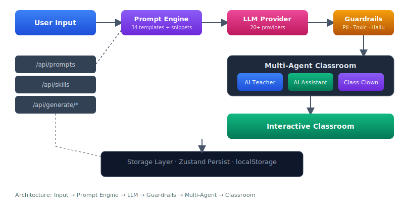

<div align="center">
  
</div>

<p align="center">
  <strong>个性化多智能体学习平台 · 将任意主题转化为互动课堂体验</strong>
</p>

<p align="center">
  <a href="./README.md">English</a> · <a href="./README-zh.md">中文</a> · <a href="./README-ja.md">日本語</a>
</p>

<p align="center">
  <a href="#"></a>
  <a href="#"></a>
  <a href="#"></a>
  <a href="#"></a>
  <a href="#"></a>
  <a href="#"></a>
  <a href="#"></a>
  <a href="#"></a>
</p>

<p align="center">
  <a href="#功能">功能</a> ·
  <a href="#快速开始">快速开始</a> ·
  <a href="#架构">架构</a> ·
  <a href="#测试">测试</a> ·
  <a href="#项目结构">项目结构</a> ·
  <a href="#贡献">贡献</a>
</p>

---

## 概述

Nova 是一个基于多智能体的智能教学平台。输入任意学习主题，AI 教师会自动生成结构化课程大纲、制作幻灯片、编写讲解词，并在虚拟课堂中实时授课。多个 AI 智能体各司其职——教师主导讲解，助教补充答疑，活跃者调节气氛——构建出沉浸式的学习体验。

核心理念：不只是一个课件生成器，而是一个有角色分工、有安全护栏、有知识追踪的完整教学系统。

## 功能

### 课程生成

- **AI 大纲生成** — 输入主题后自动拆解为多个递进式场景，按知识点依赖排序
- **幻灯片制作** — 每个场景自动生成包含标题、要点、流程图的幻灯片
- **语音讲解** — AI 教师用自然语音逐场景讲解，支持多 TTS 引擎
- **互动测验** — 自动生成选择题和填空题，实时评估学习效果
- **知识图谱** — 可视化概念关联图，帮助构建知识体系
- **PBL 模式** — 项目式学习模式，生成可交互的实践项目

### 多智能体课堂

| 智能体 | 职责 | 权限 |
|--------|------|------|
| AI 教师 | 主导教学进程，讲解核心知识 | 发言、幻灯片控制、聚光灯、白板 |
| AI 助教 | 辅助教学，回答问题 | 发言、白板、幻灯片控制 |
| 课堂活跃者 | 调节课堂气氛 | 发言 |

- **角色持久化** — 自定义 10 种内置角色的名称、描述、权限，修改跨会话保留
- **运行时约束** — 每个角色的最大动作数和发言轮次在运行时强制执行
- **讨论编排** — Director Graph 管理智能体间的讨论流程和发言顺序

### 提示词工程与治理

- **34 个模板** — 覆盖大纲生成、内容创作、动作编排、测验生成等场景
- **Snippet 系统** — 角色指南、动作类型等以 Markdown 片段管理，无需重新编译即可编辑
- **安全护栏** — PII 检测、毒性过滤、幻觉识别三重扫描，保障内容安全
- **Skill 目录** — 5 个已注册技能，受白名单门控
- **REST API** — `GET /api/prompts` 查询模板，`GET /api/skills` 查询技能

### 基础设施

<details>
<summary><strong>20+ LLM 提供商</strong></summary>

| 提供商 | 代表模型 |
|--------|---------|
| OpenAI | GPT-4o, GPT-4o-mini |
| Anthropic | Claude 3.5 Sonnet, Claude 3 Opus |
| Google | Gemini 2.0 Flash, Gemini 1.5 Pro |
| DeepSeek | DeepSeek-V4-Pro, DeepSeek-V4-Flash |
| 通义千问 | Qwen3.5-397B, Qwen3.6-35B |
| 智谱 GLM | GLM-5.2, GLM-5.1 |
| Kimi | Kimi-K2.6 |
| MiniMax | MiniMax-M3 |
| 硅基流动 | 全系列模型聚合 |
| 豆包 | Doubao 全系列 |
| Ollama | 本地模型 |
| Lemonade | 本地 AMD 模型 |

</details>

- **TTS** — OpenAI、硅基流动、豆包、Minimax、火山引擎
- **图片生成** — 硅基流动、Minimax、ComfyUI
- **网页搜索** — Tavily、SearXNG
- **文档解析** — AliDocMind、MinerU
- **MCP 工具** — 通过 Model Context Protocol 接入外部工具
- **国际化** — 英语、简体中文、繁体中文、日语、韩语、阿拉伯语、葡萄牙语、俄语
- **暗色模式** — 全站支持

## 架构

<div align="center">
  
</div>

数据流向：用户输入主题 → 提示词引擎组装 Prompt → LLM 生成内容 → 安全护栏扫描 → 多智能体编排 → 交互式课堂渲染。整个流程通过 Zustand 持久化到浏览器本地存储。

## 快速开始

### 前置要求

- Node.js 22+
- pnpm 10+

### 安装

```bash
git clone https://github.com/weed33834/nova.git
cd nova
pnpm install
```

### 配置

创建 `.env.local` 文件，至少配置一个 LLM 提供商：

```bash
# 方式一：直接配置 API 密钥
SILICONFLOW_API_KEY=你的密钥
SILICONFLOW_BASE_URL=https://api.siliconflow.cn/v1

# 方式二：服务端托管配置（推荐）
cp server-providers.example.yml server-providers.yml
# 编辑 server-providers.yml 填入凭证，密钥不会暴露给客户端
```

### 运行

```bash
pnpm dev
```

打开 [http://localhost:3000](http://localhost:3000)，输入你想学的主题即可开始。

### 免密钥体验

点击首页的 **「秒开缓存演示课程」** 按钮，无需 API 密钥即可加载预置的「人工智能导论」课程，立即体验课堂 UI。

## 测试

```bash
pnpm test          # 单元和组件测试（312 个文件 / 2768 个用例）
pnpm test:e2e      # 端到端测试（Playwright）
pnpm test:e2e:ui   # 带交互界面的端到端测试
pnpm lint          # ESLint 代码检查
pnpm typecheck     # TypeScript 类型检查
```

E2E 测试覆盖完整流程：首页 → 生成 → 课堂导航 → 测验交互。全部使用 Mock API，无需 LLM 密钥。

## 项目结构

```
nova/
├── app/                  # Next.js App Router
│   ├── api/              # API 路由（prompts, skills, generate/*）
│   └── [locale]/         # 国际化路由
├── lib/                  # 核心逻辑
│   ├── ai/               # 多 LLM 提供商集成
│   ├── agent/            # 多智能体运行时
│   ├── choreography/     # 动画与特效
│   ├── guardrails/       # 安全护栏管线
│   ├── orchestration/    # 角色管理与约束
│   └── prompts/          # 提示词模板与代码片段
├── components/           # React 组件
├── packages/             # 工作区子包
│   └── @nova/
│       ├── dsl/          # 领域类型定义
│       ├── renderer/     # 幻灯片渲染引擎
│       ├── importer/     # 文档导入
│       └── storage/      # 持久化层
├── e2e/                  # Playwright 测试
├── configs/              # 共享常量
└── assets/               # 静态资源与 Logo
```

## 技术栈

| 层面 | 技术 |
|------|------|
| 框架 | Next.js 16（App Router, Turbopack） |
| 语言 | TypeScript 5.8 |
| UI | React 19, Tailwind CSS 4, Radix UI |
| 状态 | Zustand（持久化） |
| AI | Vercel AI SDK，多提供商 |
| 测试 | Vitest, Playwright |
| 包管理 | pnpm Workspaces |

## 贡献

欢迎提交 Issue 和 Pull Request。提交前请阅读 [CONTRIBUTING.md](CONTRIBUTING.md)。

## 许可证

[MIT](LICENSE)
