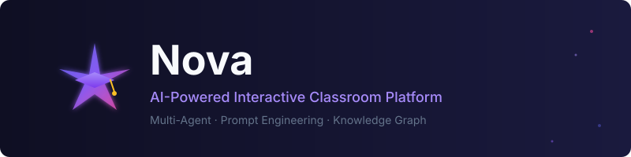

<div align="center">
  
</div>

<p align="center">
  <strong>AI 驱动的多智能体课堂 —— 将任何话题转化为互动式学习体验。</strong>
</p>

<p align="center">
  <a href="./README.md">English</a> · <a href="./README-zh.md">中文</a>
</p>

<p align="center">
  <a href="#"></a>
  <a href="#"></a>
  <a href="#"></a>
  <a href="#"></a>
  <a href="#"></a>
  <a href="#"></a>
  <a href="#"></a>
  <a href="#"></a>
</p>

---

## 概述

Nova 是一个多智能体教学平台。输入一个话题，AI 教师会自动生成结构化课程大纲，制作课件幻灯片，编写讲解脚本，并在虚拟教室中完成授课。多个 AI 智能体协同工作——老师主持、助教答疑、活跃气氛的"班级小丑"让课堂更生动。

核心思想：不仅是一个幻灯片生成器，而是一个完整的教学系统，具备角色分离、安全护栏和知识追踪能力。

## 快速开始

### 环境要求

- Node.js 22+
- pnpm 10+

### 安装

```bash
git clone https://gitcode.com/badhope/nova.git
cd nova
pnpm install
```

### 配置

创建 `.env.local` 文件，至少配置一个 LLM 提供商：

```bash
# 方式 A：直接 API Key
OPENAI_API_KEY=your-key
OPENAI_BASE_URL=https://api.openai.com/v1

# 方式 B：服务端管理配置（推荐）
cp server-providers.yml.example server-providers.yml
# 编辑 server-providers.yml 填入凭据
```

### 运行

```bash
pnpm dev
```

打开 [http://localhost:3000](http://localhost:3000)，输入话题即可开始。

### 无需 API Key？试试 Demo

点击首页的 **"打开缓存 Demo 课程"**，加载预构建的 AI 入门课程——无需 API Key。

## 主要特性

### 课程生成

- **AI 大纲生成**：将话题拆解为递进式场景，按知识依赖排序
- **幻灯片制作**：每个场景生成标题、要点和流程图
- **语音讲解**：AI 教师通过多引擎 TTS 为每个场景提供自然语音讲解
- **互动测验**：自动生成选择题和填空题，实时评分
- **知识图谱**：可视化概念地图，连接课程中的关键概念
- **PBL 模式**：基于项目的互动学习练习

### 多智能体课堂

| 智能体 | 角色 | 权限 |
|-------|------|------|
| AI 教师 | 主导授课，讲解核心概念 | 讲话、幻灯片控制、聚光灯、白板 |
| AI 助教 | 辅助教学，答疑解惑 | 讲话、白板、幻灯片控制 |
| 班级小丑 | 活跃气氛 | 讲话 |

### 提示词工程与治理

- **34 个模板**：覆盖大纲生成、内容创作、动作编排和测验生成
- **Guardrails 安全护栏**：每场景进行 PII 检测、毒性过滤、幻觉扫描
- **Skill 注册系统**：5 个注册技能，白名单管控

### 基础设施

- **17 个 LLM 提供商**：OpenAI、Azure、Anthropic、Google、DeepSeek、Qwen、GLM、Kimi 等
- **多引擎 TTS**：OpenAI、SiliconFlow、Doubao、Minimax、Volcano
- **图片生成**：SiliconFlow、Minimax、ComfyUI
- **网页搜索**：Tavily、SearXNG
- **文档解析**：AliDocMind、MinerU
- **MCP 工具**：通过 Model Context Protocol 接入外部工具
- **国际化**：英语、简体中文、繁体中文、日语、韩语、阿拉伯语、葡萄牙语、俄语
- **暗色模式**：全站支持

### 企业级特性

- **配额管理**：按用户生成配额，超限返回 402
- **输入验证**：所有生成 API 路由验证输入长度和内容
- **审计日志**：所有 API 操作记录，默认 90 天保留
- **速率限制**：端点级可配置速率限制
- **SSRF 防护**：外发请求 URL 白名单/黑名单
- **内容审查**：PII 检测、毒性过滤、幻觉扫描
- **RBAC**：10 个可配置智能体角色，细粒度权限
- **知识追踪**：贝叶斯知识追踪，记录学生学习进度

## 架构

数据流：用户输入话题 → 提示引擎组装提示词 → LLM 生成内容 → Guardrails 安全扫描 → 多智能体编排 → 互动课堂渲染。

## 测试

```bash
pnpm test          # 单元 & 组件测试 (340 文件 / 3155 用例)
pnpm test:e2e      # E2E 测试 (Playwright)
pnpm lint          # ESLint
pnpm typecheck     # TypeScript 类型检查
```

## 技术栈

| 层级 | 技术 |
|------|------|
| 框架 | Next.js 16 (App Router, Turbopack) |
| 语言 | TypeScript 5.9 |
| UI | React 19, Tailwind CSS 4, Radix UI |
| 状态管理 | Zustand (持久化) |
| AI | Vercel AI SDK, 多提供商 |
| 测试 | Vitest, Playwright |
| 包管理 | pnpm Workspaces |

## 镜像

| 平台 | URL | 角色 |
|------|-----|------|
| **GitCode** (主仓库) | https://gitcode.com/badhope/nova | 代码源、Issue、PR |
| GitHub (镜像) | https://github.com/weed33834/nova | 只读镜像 |

> GitCode 是主要开发平台。请在 GitCode 提交 Issue 和 PR。

## 贡献

欢迎提交 Issue 和 PR。提交前请阅读 [CONTRIBUTING.md](CONTRIBUTING.md)。

## 许可证

[MIT](LICENSE)
