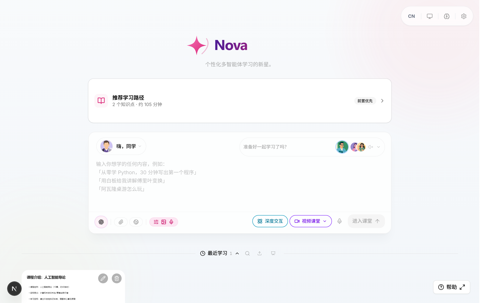
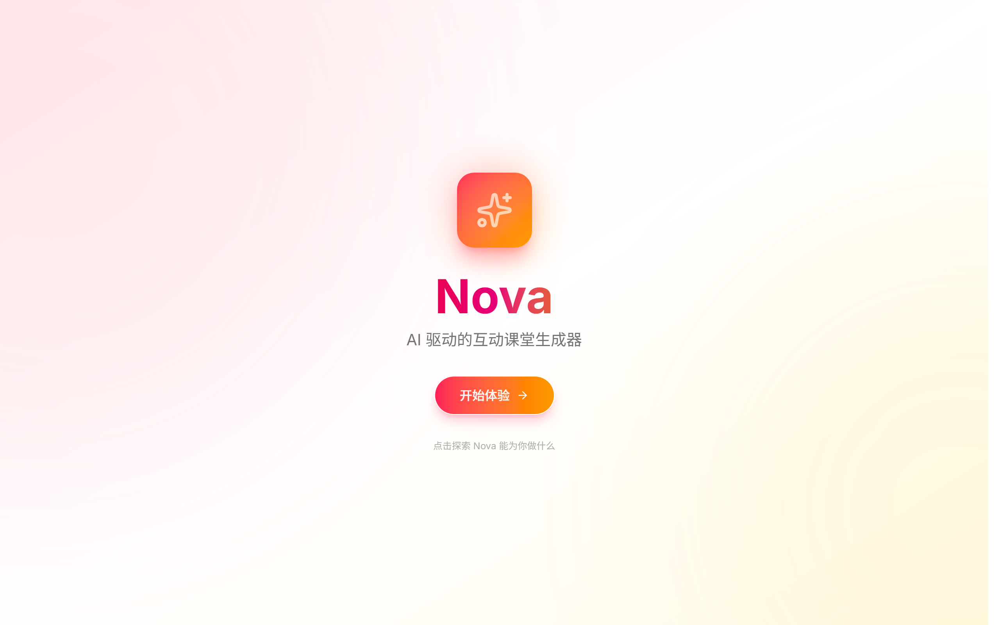
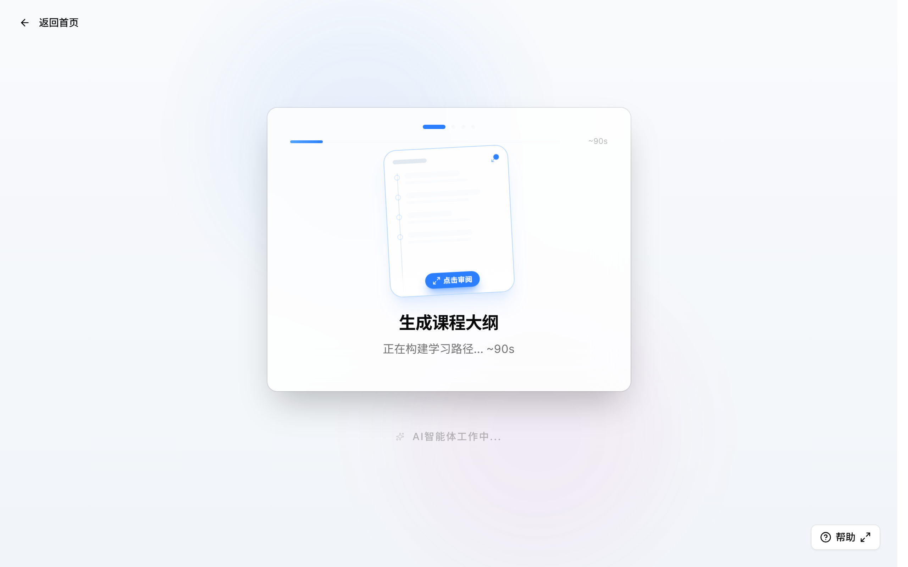
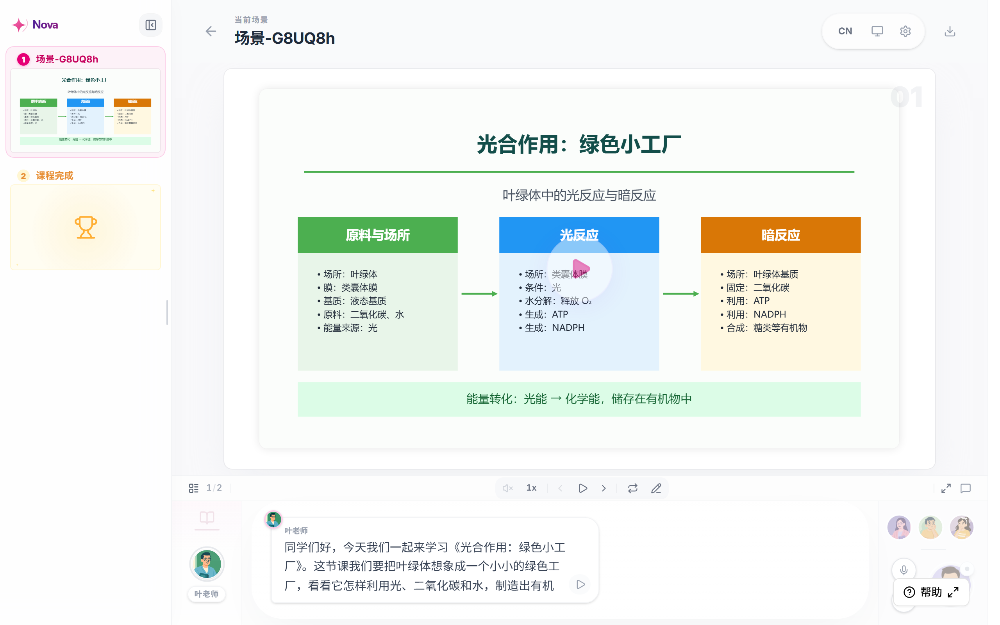
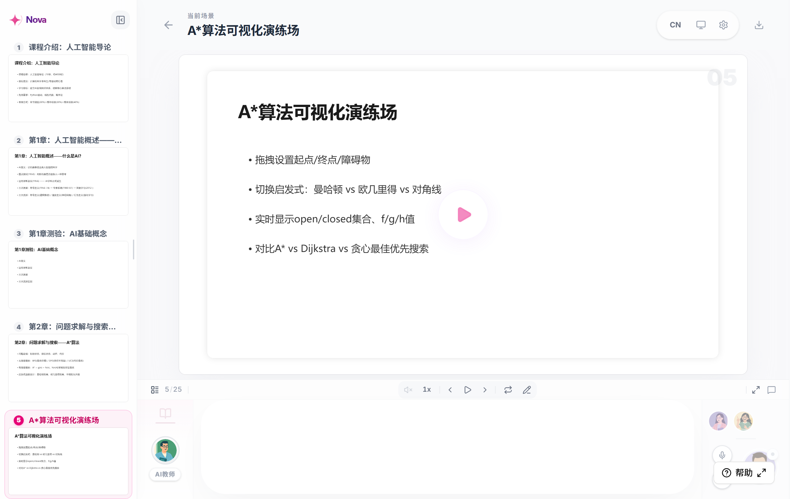
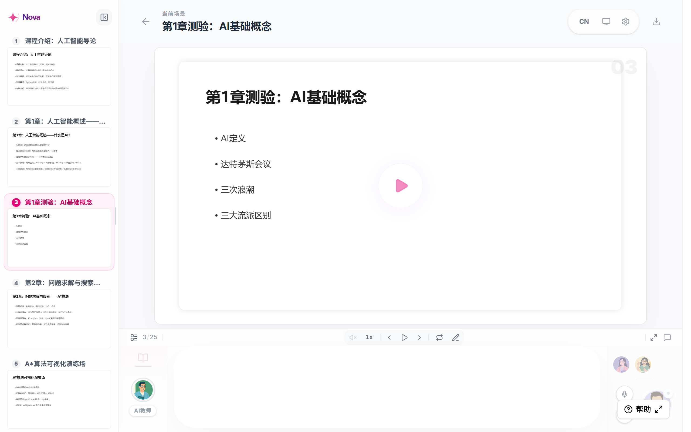
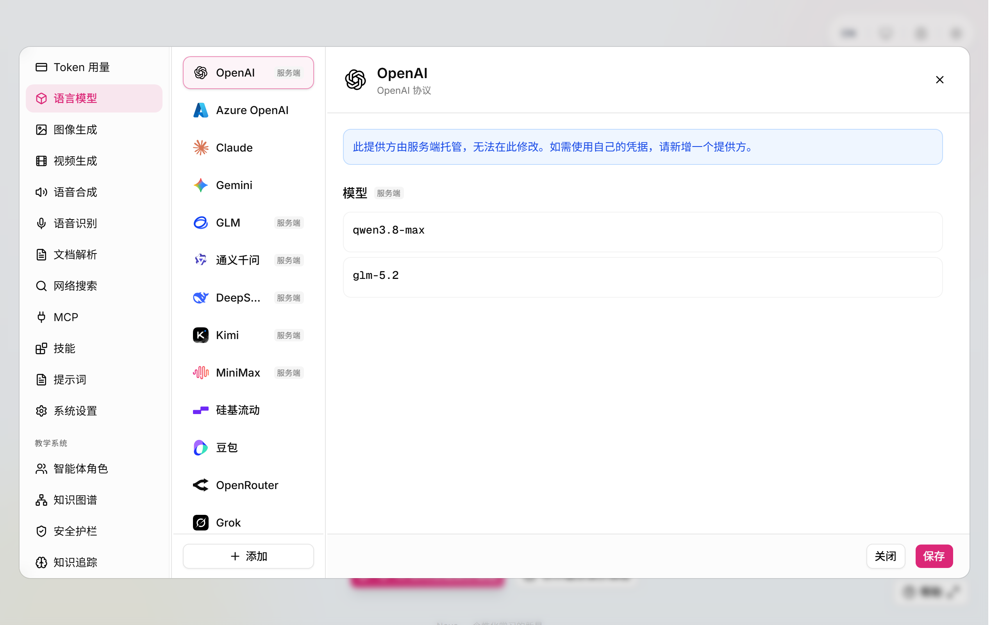
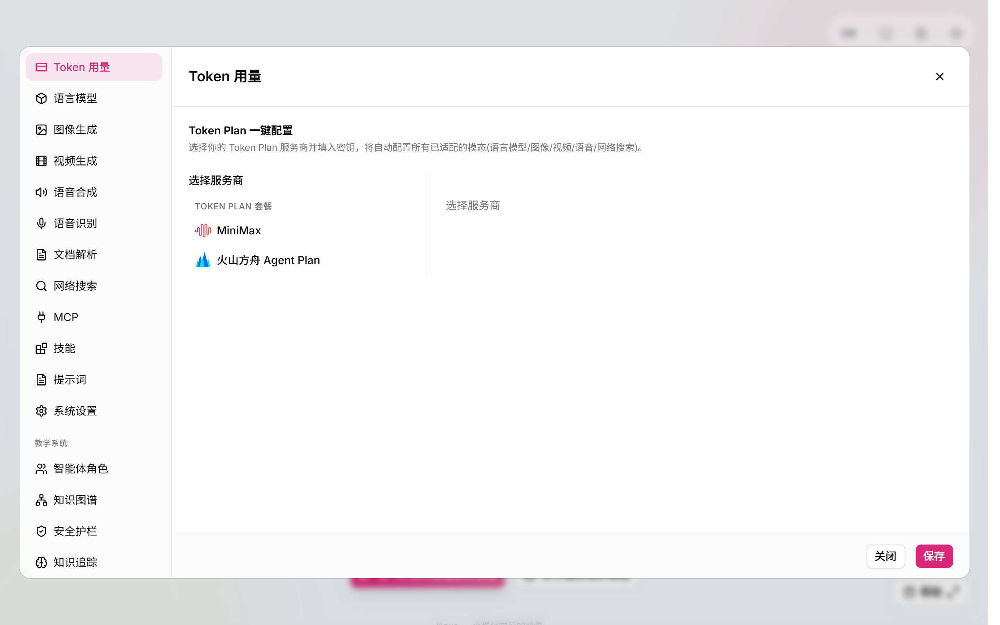
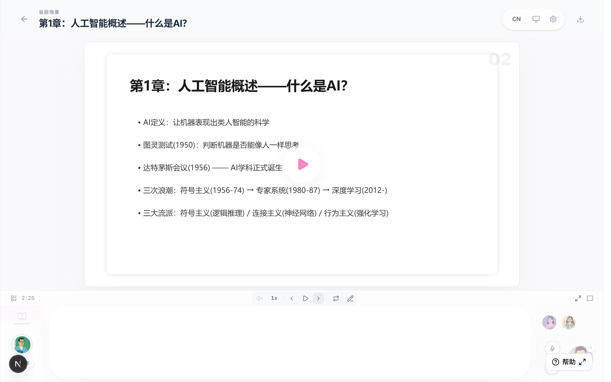
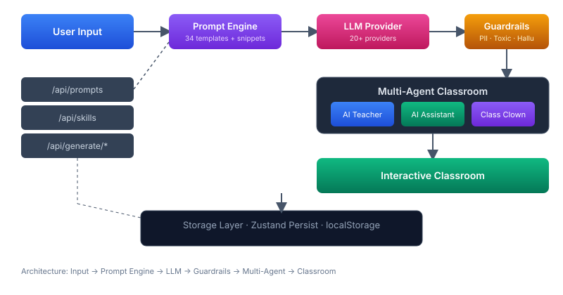

<div align="center">
  
</div>

<p align="center">
  <strong>AI 驱动的多智能体课堂 —— 把任何一个话题变成可互动的课程。</strong>
</p>

<p align="center">
  <a href="./README.md">English</a> · <a href="./README-zh.md">中文</a>
</p>

<p align="center">
  <a href="https://nextjs.org"></a>
  <a href="https://react.dev"></a>
  <a href="https://www.typescriptlang.org"></a>
  <a href="https://tailwindcss.com"></a>
  <a href="./LICENSE"></a>
  <a href="#测试"></a>
  <a href="#主要特性"></a>
  <a href="#主要特性"></a>
  <a href="https://gitcode.com/badhope/nova"></a>
</p>

---

## 这是做什么的？

Nova 是一个多智能体教学平台。你在首页输入一个话题，AI 会把它拆成结构化的课程大纲，生成幻灯片、讲解脚本，再让多个 AI 角色在虚拟课堂里协作授课：主讲老师把控节奏，助教随时答疑，还有一个活跃气氛的“班级小丑”。

它不只是幻灯片生成器，而是一套有角色分工、安全护栏和知识追踪的完整教学系统。

<div align="center">
  
  <p><em>首页：输入任意话题，秒开缓存 Demo 即可体验完整课堂</em></p>
</div>

## 演示视频

> 完整演示（约 10 分钟）：**真实 LLM 生成流程**（输入话题 → 大纲 → 课堂角色 → 幻灯片 → 进入课堂）+ **完整课堂交互**（播放 / 24 场景浏览 / 设置面板 14 项配置逐个演示）。

<p align="center">
  <video src="assets/Nova-完整演示-最终版.mp4" controls width="900" poster="docs/screenshots/04-classroom-playback.png">
    您的浏览器不支持 video 标签，请<a href="assets/Nova-完整演示-最终版.mp4">下载视频</a>观看。
  </video>
</p>

### 界面预览

| 首页与主题输入 | LLM 生成过程 | 课堂播放 |
|:---:|:---:|:---:|
|  |  |  |

| 侧边栏场景导航 | 交互演练场 | 随堂测验场景 |
|:---:|:---:|:---:|
|  |  |  |

| 设置面板 | Token 用量 | 语言模型配置 |
|:---:|:---:|:---:|
|  |  |  |

## 快速开始

### 环境要求

- Node.js 22+
- pnpm 10+

### 安装

```bash
git clone https://gitcode.com/badhope/nova.git
cd nova
pnpm install
```

> **安装太慢？** 见 [docs/DEPENDENCY-TIERING.md](docs/DEPENDENCY-TIERING.md) 的分级安装方案：
> - 只想快速跑起来：`pnpm install --prod`（跳过开发工具链，1~2 分钟）
> - 维护者按需补齐高级功能：`node scripts/install-tiers.mjs core|extras|all`
>
> 未安装的高级功能（图表、公式、代码高亮、MCP、文档解析等）**不会阻断启动**——对应功能自动降级（纯文本/占位提示/指引错误）。打开 **设置 → 功能能力状态** 卡片可查看已装/未装清单，并一键复制安装命令。

### 配置

创建 `.env.local`，至少配一个 LLM 提供商：

```bash
# 方式 A：直接填 API Key
OPENAI_API_KEY=your-key
OPENAI_BASE_URL=https://api.openai.com/v1

# 方式 B：服务端管理配置（推荐，Key 不暴露给前端）
cp server-providers.yml.example server-providers.yml
# 编辑 server-providers.yml 填入凭据
```

其他可选环境变量：

```bash
DEFAULT_MODEL=openai:your-model        # 默认模型，格式：provider:model
LLM_TIMEOUT_MS=300000                  # LLM 请求超时
FALLBACK_MODELS=openai:m2,openai:m3    # 兜底模型列表
LLM_THINKING_DISABLED=true             # 关闭思考/推理 token
SKIP_TS_CHECK=true                     # 构建时跳过 TypeScript 检查
```

### 运行

```bash
pnpm dev
```

打开 [http://localhost:3000](http://localhost:3000)，输入话题即可开始。

### 没有 API Key？先试试 Demo

首页点击 **“秒开缓存演示课程”**，会加载一门预置的《人工智能导论》课程，无需任何 API Key。

## 主要特性

### 课程生成

- **AI 大纲生成**：把话题拆成递进式场景，按知识依赖排序
- **幻灯片制作**：每个场景生成标题、要点和流程图
- **语音讲解**：多引擎 TTS，让 AI 教师自然朗读每页内容
- **互动测验**：自动生成选择、填空题，实时评分
- **知识图谱**：可视化概念地图，串联课程关键概念
- **PBL 模式**：基于项目的互动学习任务

### 多智能体课堂

<div align="center">
  
  <p><em>课堂：AI 教师、助教与班级小丑协同授课的虚拟教室</em></p>
</div>

| 智能体 | 角色 | 权限 |
|-------|------|------|
| AI 教师 | 主导授课，讲解核心概念 | 讲话、幻灯片控制、聚光灯、白板 |
| AI 助教 | 辅助教学，答疑解惑 | 讲话、白板、幻灯片控制 |
| 班级小丑 | 活跃气氛 | 讲话 |

- **角色持久化**：可自定义 10 种内置角色的名称、描述和权限，设置会保存到本地
- **运行时限**：每个角色有独立的 `max_actions` 和 `max_turns`，执行时强制生效
- **讨论编排**：Director Graph 管理发言顺序和讨论节奏

### 提示词工程与治理

- **34 个模板**：覆盖大纲生成、内容创作、动作编排和测验生成
- **Snippet 系统**：角色 guideline 和动作类型以 Markdown 片段管理，修改后无需重新编译
- **安全护栏**：每一场景都会做 PII 检测、毒性过滤和幻觉扫描
- **Skill 注册表**：5 个内置 Skill，白名单管控
- **REST API**：`GET /api/prompts` 列出模板，`GET /api/skills` 列出 Skill

### 基础设施

<details>
<summary><strong>17 个 LLM 提供商</strong></summary>

| 提供商 | 示例模型 |
|----------|---------------|
| OpenAI | GPT-5.6, GPT-5.4 |
| Azure OpenAI | 用户自定义部署 |
| Anthropic | Claude Opus 4.8, Claude Sonnet 4.6 |
| Google | Gemini 3.5 Flash, Gemini 2.5 Pro |
| DeepSeek | DeepSeek-V4-Pro, DeepSeek-V4-Flash |
| Qwen | Qwen3.7 Plus, Qwen3.6 Flash |
| GLM | GLM-5.2, GLM-4.6 |
| Kimi | Kimi-K2.7, Kimi-K2.6 |
| MiniMax | MiniMax-M3 |
| SiliconFlow | 全模型聚合 |
| Doubao | Doubao Seed 系列 |
| OpenRouter | DeepSeek 等 |
| Grok | Grok 4.20, Grok 4.1 |
| Tencent Hunyuan | Hy3 Preview |
| Xiaomi MiMo | MiMo V2.5 Pro, MiMo V2 |
| Ollama | 本地模型 |
| Lemonade | 本地 AMD 模型 |

</details>

- **TTS**：OpenAI、SiliconFlow、Doubao、Minimax、Volcano
- **图片生成**：SiliconFlow、Minimax、ComfyUI
- **网页搜索**：Tavily、SearXNG
- **文档解析**：AliDocMind、MinerU
- **MCP 工具**：通过 Model Context Protocol 接入外部工具
- **国际化**：英语、简体中文、繁体中文、日语、韩语、阿拉伯语、葡萄牙语、俄语
- **暗色模式**：全站支持

### 企业级特性

- **配额管理**：按用户生成配额，超限返回 402
- **输入校验**：所有生成接口校验输入长度和内容
- **审计日志**：API 操作记录，默认保留 90 天
- **速率限制**：端点级可配置限流
- **SSRF 防护**：外发请求 URL 白名单/黑名单
- **内容审查**：PII 检测、毒性过滤、幻觉扫描
- **RBAC**：10 个可配置智能体角色，细粒度权限
- **知识追踪**：贝叶斯知识追踪，记录学生学习进度

## 架构

<div align="center">
  
</div>

数据流：用户输入话题 → 提示引擎组装提示词 → LLM 生成内容 → Guardrails 安全扫描 → 多智能体编排 → 互动课堂渲染。状态通过 Zustand 持久化到浏览器本地存储。

## 测试

```bash
pnpm test          # 单元 & 组件测试（340 文件 / 3155 用例）
pnpm test:e2e      # E2E 测试（Playwright）
pnpm test:e2e:ui   # E2E 交互式 UI
pnpm lint          # ESLint
pnpm typecheck     # TypeScript 类型检查
```

E2E 覆盖完整流程：首页 → 生成 → 课堂导航 → 测验互动。测试使用 Mock API，不需要 LLM Key。

## 项目结构

```
nova/
├── app/                  # Next.js App Router
│   ├── api/              # API 路由（prompts、skills、generate/*）
│   └── [locale]/         # i18n 路由
├── lib/                  # 核心逻辑
│   ├── ai/               # 多 LLM 提供商集成
│   ├── agent/            # 多智能体运行时
│   ├── choreography/     # 动画与特效
│   ├── guardrails/       # 安全管道
│   ├── orchestration/    # 角色管理与约束
│   └── prompts/          # 提示模板与片段
├── components/           # React 组件
├── packages/             # Workspace 子包
│   └── @nova/
│       ├── dsl/          # 领域类型定义
│       ├── renderer/     # 幻灯片渲染引擎
│       ├── importer/     # 文档导入
│       └── storage/      # 持久化层
├── e2e/                  # Playwright 测试
├── configs/              # 共享常量
└── assets/               # 静态资源与截图
```

## 技术栈

| 层级 | 技术 |
|------|------|
| 框架 | Next.js 16（App Router + Turbopack） |
| 语言 | TypeScript 5.9 |
| UI | React 19、Tailwind CSS 4、Radix UI |
| 状态管理 | Zustand（持久化） |
| AI | Vercel AI SDK，多提供商 |
| 测试 | Vitest、Playwright |
| 包管理 | pnpm Workspaces |

## 镜像

| 平台 | URL | 角色 |
|------|-----|------|
| **GitCode（主仓库）** | https://gitcode.com/badhope/nova | 代码源、Issue、PR |
| GitHub（镜像） | https://github.com/weed33834/nova | 只读镜像 |
| Gitee（镜像） | https://gitee.com/badhope/nova | 只读镜像 |

> GitCode 是主要开发平台。请在 GitCode 提交 Issue 和 PR。三平台保持同步（`git push` 依次推送）。

## 常见问题（FAQ）

**Q：首页"进入课堂"按钮是灰的（disabled）？**
A：说明没有可用的 LLM provider。检查 `.env.local` 的 `OPENAI_API_KEY` 是否有效，或参考 [server-providers.yml.example](server-providers.yml.example) 配置服务端凭据。服务端配置优先（Key 不暴露给前端）。

**Q：生成时提示"模型未返回有效的场景内容"？**
A：多为模型额度耗尽或暂时不可用。执行 `node scripts/verify-models.mjs` 探活，把可用模型填入 `.env.local` 的 `DEFAULT_MODEL` 与 `LLM_FALLBACK_MODELS`。已实测 `qwen3.8-max`（快）与 `glm-5.2`（稳）可用。

**Q：本地 `pnpm dev` 打开课堂路由很慢 / 报 ChunkLoadError？**
A：dev 模式按需编译会导致首次访问课堂路由慢（几十秒），极端情况 chunk 加载超时。演示/录制场景建议 `pnpm build && pnpm start`（生产模式，全路由预编译）。

**Q：想开启"编辑课程"（Pro 模式）按钮？**
A：在 `.env.local` 设置 `NEXT_PUBLIC_NOVA_EDITOR_ENABLED=true` 并重新构建。注意该变量需在 build 时内联到客户端产物，仅改运行环境变量不生效。

**Q：遇到其他启动问题？**
A：参见 [docs/OPERATIONS-HANDBOOK.md](docs/OPERATIONS-HANDBOOK.md) 故障排查手册（含 17 个历史问题的症状→根因→修复→防范）与启动前检查清单。

## 贡献

欢迎提交 Issue 和 PR。提交前请阅读 [CONTRIBUTING.md](CONTRIBUTING.md)。

## 许可证

[MIT](LICENSE)
